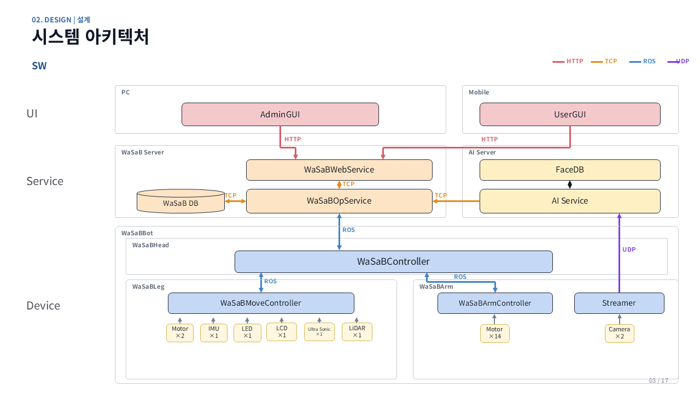

# WaSaB - School Workmate Robot

WaSaB는 **Workmate + School + Bot**의 의미를 담은 학교 업무 지원용 통합 로봇 플랫폼입니다. 교사를 안전하게 추종하고, 교보재 운반과 선물 전달을 지원하며, 교내를 순찰하면서 화재·외부인을 감지하고 재활용품을 분류합니다.

> 수업 보조 · 교내 순찰 · 로봇암 제어를 위한 통합 로봇 플랫폼

## 주요 기능

- **AI 인지·추종·안전 감지**: 등록된 교사와 외부인, 손동작, 화재를 인식하고 안전거리를 유지하며 추종
- **자율주행·순찰**: ROS 2 기반 위치·지도·경로 계획, 웨이포인트 순찰, 장애물 회피 및 AprilTag 기반 충전 거점 복귀
- **Manipulation**: 카메라 인지와 좌표 변환을 결합한 교보재 운반, 분리수거, 양팔 선물 전달
- **통합 GUI**: 얼굴 로그인, 전체 현황, 순찰·로봇 상태, 이벤트 알림을 PC와 모바일에서 제공
- **통합 제어**: 이동 로봇과 좌·우 JetCobot 로봇팔을 하나의 운영 흐름에서 관리

## 운영 시나리오

### 선생님 지원

1. 등록된 선생님을 인식하고 안전거리에서 추종합니다.
2. 교보재를 한팔로 집어 교실 또는 지정 위치까지 운반합니다.
3. 손바닥 제스처를 인식한 뒤 양팔 협업으로 학생에게 선물을 전달합니다.

### 교내 순찰

1. 지정 경로의 웨이포인트를 따라 순찰하며 장애물을 회피합니다.
2. 화재나 외부인을 감지하면 정지하고 관리자 시스템에 즉시 알립니다.
3. 순찰 중 발견한 캔, 종이류, 페트병 등의 재활용품을 인식하고 분류합니다.
4. 순찰 완료 후 AprilTag를 기준으로 충전 거점에 복귀합니다.

## 기술 스택

| 영역 | 기술 |
|---|---|
| Robot / Middleware | ROS 2 Jazzy, Nav2, SLAM |
| AI / Vision | YOLO26s, OpenCV, MediaPipe, InsightFace |
| Backend | Python, FastAPI |
| Platform | Ubuntu |

## 시스템 구성



## 저장소 구조

```text
WaSaB/
├─ Device/
│  └─ WasabBot/
│     ├─ WasabArmController/    # JetCobot 양팔 클라이언트와 제어 코드
│     └─ WasabMoveController/   # Pinky 주행, 순찰, 도킹, 로봇 에이전트
├─ Service/
│  ├─ WasabAIServer/            # AI 인식 및 로봇 제어 API
│  └─ WasabServer/              # WebService, 실행기, 운영 스크립트
├─ UI/
│  ├─ mobile/user_gui/          # 통합 Web UI
│  └─ pc/                       # 데스크톱 실행 항목
├─ DEPLOYMENT_GUIDE.md
├─ RUN_GUIDE.md
├─ USER_MANUAL.md
└─ CODE_STRUCTURE.md
```

## 요구 환경

- Ubuntu (ROS 2 Jazzy 지원 환경)
- Python 3 (배포 환경에 맞는 버전)
- ROS 2 Jazzy
- 같은 LAN에 연결된 운영 PC, JetCobot, Pinky 로봇
- 운영 PC의 AI 서버용 Python 가상환경

기본 배포 환경은 다음 경로를 사용합니다.

```text
운영 PC 프로젝트: /home/ane/dev_ws/src/roscamp-repo-3
AI 가상환경:      /home/ane/dev_ws/.venv-server
JetCobot 프로젝트: /home/jetcobot/wasab/roscamp-repo-3
JetCobot Python:   /home/jetcobot/venv/wasabarm/bin/python
```

## 설치

운영 PC에서 AI 서버 의존성을 설치합니다.

```bash
python3 -m venv /home/ane/dev_ws/.venv-server
/home/ane/dev_ws/.venv-server/bin/pip install --upgrade pip
/home/ane/dev_ws/.venv-server/bin/pip install \
  -r Service/WasabAIServer/AIService/ai_service/requirements.txt
/home/ane/dev_ws/.venv-server/bin/pip install \
  -r Service/WasabAIServer/AIService/face-recog/requirements.txt
python3 -m pip install PyQt6
```

각 JetCobot에서 로봇팔 클라이언트 의존성을 설치합니다.

```bash
/home/jetcobot/venv/wasabarm/bin/pip install \
  -r Device/WasabBot/WasabArmController/requirements.txt
```

장치별 IP, ROS Domain, 카메라 및 시리얼 장치 설정은 배포 전에 환경에 맞게 조정해야 합니다.

## 빠른 실행

### 통합 실행기

```bash
cd /home/ane/dev_ws/src/roscamp-repo-3
python3 Service/WasabServer/Launcher/wasab_launcher.py
```

실행기에서 필요한 서버와 로봇을 선택하고 IP 및 ROS Domain을 확인한 후 시작합니다. 통합 GUI의 기본 주소는 다음과 같습니다.

```text
http://127.0.0.1:8100
```

### 수동 실행

AI/로봇 제어 서버:

```bash
cd Service/WasabAIServer/AIService/ai_service
/home/ane/dev_ws/.venv-server/bin/python -u run_server.py
```

서버 상태 확인:

```bash
curl http://192.168.2.8:8000/health
```

WebService:

```bash
./Service/WasabServer/scripts/run_webapp.sh
```

각 JetCobot의 로봇팔 클라이언트:

```bash
cd /home/jetcobot/wasab/roscamp-repo-3/Device/WasabBot/WasabArmController
/home/jetcobot/venv/wasabarm/bin/python -u run_client.py
```

## 기본 네트워크 설정

| 구성 요소 | 기본값 |
|---|---|
| AI Server | `192.168.2.8:8000` |
| 통합 Web GUI | `127.0.0.1:8100` |
| Left Arm | `192.168.2.10` |
| Right Arm | `192.168.2.12` |
| Console ROS Domain | `50` |

위 값은 기본 배포 예시이며 실제 네트워크 환경에 맞게 변경해야 합니다.

## 보안 및 로컬 데이터

비밀번호를 코드나 설정 파일에 직접 저장하지 마세요. 실행 전에 필요한 SSH 비밀번호를 환경변수로 제공합니다.

```bash
export WASAB_ARM_PASSWORD='<left-or-arm-password>'
export WASAB_PINKY_PASSWORD='<pinky-password>'
export WASAB_SSH_PASSWORD='<integration-script-password>'
```

다음 데이터는 개인정보 또는 대용량 파일이므로 Git에서 제외됩니다.

- `Service/WasabAIServer/FaceDB/`: 얼굴 사진과 얼굴 임베딩
- `*.pt`, `*.onnx`, `*.ckpt`: AI 모델 가중치
- `.env`, `*.key`: 비밀정보와 키 파일

필요한 얼굴 데이터와 모델 파일은 각 실행 환경에 별도로 배포해야 합니다.

## 문서

- [배포 가이드](DEPLOYMENT_GUIDE.md)
- [실행 가이드](RUN_GUIDE.md)
- [작업 환경 가정](WORKING_ASSUMPTIONS.md)
- [사용자 매뉴얼](USER_MANUAL.md)
- [코드 구조](CODE_STRUCTURE.md)

## 문제 해결

- AI 서버가 응답하지 않으면 `curl http://<AI_SERVER_IP>:8000/health`로 상태를 확인합니다.
- 로봇팔이 동작하지 않으면 `run_client.py` 로그와 `/dev/ttyJETCOBOT` 연결을 확인합니다.
- 카메라 영상이 없으면 `/dev/video*`와 `/dev/v4l/by-id/` 장치를 확인합니다.
- 통합 실행기 로그는 기본적으로 `/tmp/wasab-launcher/`에 기록됩니다.

자세한 배포 절차와 장치별 실행 순서는 [DEPLOYMENT_GUIDE.md](DEPLOYMENT_GUIDE.md)와 [RUN_GUIDE.md](RUN_GUIDE.md)를 참고하세요.
