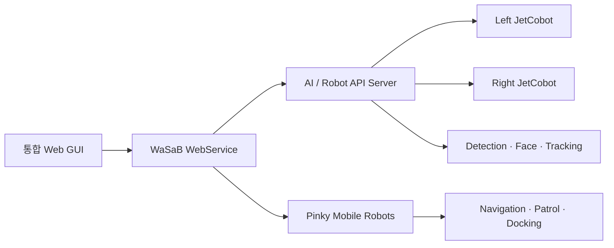

# WaSaB

WaSaB는 이동 로봇, 양팔 로봇, AI 인식 서버, 운영용 Web GUI를 하나의 저장소에서 실행·관리하기 위한 통합 로봇 시스템입니다.

## 주요 기능

- JetCobot 좌·우 로봇팔 제어 및 Dual Arm 작업
- Pinky 이동 로봇의 주행, 순찰, 도킹 및 상태 중계
- YOLO 기반 객체·화재 감지와 얼굴 인식·추적
- 운영자용 통합 Web GUI와 데스크톱 실행기
- ROS 2 기반 장치 간 통신 및 다중 로봇 관리

## 시스템 구성



## 저장소 구조

```text
WaSaB/
├─ Device/
│  └─ WasabBot/
│     ├─ WasabArmController/    # JetCobot 양팔 클라이언트와 제어 코드
│     └─ WasabMoveController/   # Pinky 주행, 순찰, 도킹, 로봇 에이전트
├─ Service/
│  ├─ WasabAIServer/            # AI 인식 및 로봇 제어 API
│  └─ WasabServer/              # WebService, 실행기, 운영 스크립트
├─ UI/
│  ├─ mobile/user_gui/          # 통합 Web UI
│  └─ pc/                       # 데스크톱 실행 항목
├─ DEPLOYMENT_GUIDE.md
├─ RUN_GUIDE.md
└─ USER_MANUAL.html
```

## 요구 환경

- Ubuntu 22.04 이상
- Python 3.10 이상
- ROS 2 Humble
- 같은 LAN에 연결된 운영 PC, JetCobot, Pinky 로봇
- 운영 PC의 AI 서버용 Python 가상환경

기본 배포 환경은 다음 경로를 사용합니다.

```text
운영 PC 프로젝트: /home/ane/dev_ws/src/roscamp-repo-3
AI 가상환경:      /home/ane/dev_ws/.venv-server
JetCobot 프로젝트: /home/jetcobot/wasab/roscamp-repo-3
JetCobot Python:   /home/jetcobot/venv/wasabarm/bin/python
```

## 설치

운영 PC에서 AI 서버 의존성을 설치합니다.

```bash
python3 -m venv /home/ane/dev_ws/.venv-server
/home/ane/dev_ws/.venv-server/bin/pip install --upgrade pip
/home/ane/dev_ws/.venv-server/bin/pip install \
  -r Service/WasabAIServer/AIService/ai_service/requirements.txt
/home/ane/dev_ws/.venv-server/bin/pip install \
  -r Service/WasabAIServer/AIService/face-recog/requirements.txt
python3 -m pip install PyQt6
```

각 JetCobot에서 로봇팔 클라이언트 의존성을 설치합니다.

```bash
/home/jetcobot/venv/wasabarm/bin/pip install \
  -r Device/WasabBot/WasabArmController/requirements.txt
```

장치별 IP, ROS Domain, 카메라 및 시리얼 장치 설정은 배포 전에 환경에 맞게 조정해야 합니다.

## 빠른 실행

### 통합 실행기

```bash
cd /home/ane/dev_ws/src/roscamp-repo-3
python3 Service/WasabServer/Launcher/wasab_launcher.py
```

실행기에서 필요한 서버와 로봇을 선택하고 IP 및 ROS Domain을 확인한 후 시작합니다. 통합 GUI의 기본 주소는 다음과 같습니다.

```text
http://127.0.0.1:8100
```

### 수동 실행

AI/로봇 제어 서버:

```bash
cd Service/WasabAIServer/AIService/ai_service
/home/ane/dev_ws/.venv-server/bin/python -u run_server.py
```

서버 상태 확인:

```bash
curl http://192.168.2.8:8000/health
```

WebService:

```bash
./Service/WasabServer/scripts/run_webapp.sh
```

각 JetCobot의 로봇팔 클라이언트:

```bash
cd /home/jetcobot/wasab/roscamp-repo-3/Device/WasabBot/WasabArmController
/home/jetcobot/venv/wasabarm/bin/python -u run_client.py
```

## 기본 네트워크 설정

| 구성 요소 | 기본값 |
|---|---|
| AI Server | `192.168.2.8:8000` |
| 통합 Web GUI | `127.0.0.1:8100` |
| Left Arm | `192.168.2.10` |
| Right Arm | `192.168.2.12` |
| Console ROS Domain | `50` |

위 값은 기본 배포 예시이며 실제 네트워크 환경에 맞게 변경해야 합니다.

## 보안 및 로컬 데이터

비밀번호를 코드나 설정 파일에 직접 저장하지 마세요. 실행 전에 필요한 SSH 비밀번호를 환경변수로 제공합니다.

```bash
export WASAB_ARM_PASSWORD='<left-or-arm-password>'
export WASAB_PINKY_PASSWORD='<pinky-password>'
export WASAB_SSH_PASSWORD='<integration-script-password>'
```

다음 데이터는 개인정보 또는 대용량 파일이므로 Git에서 제외됩니다.

- `Service/WasabAIServer/FaceDB/`: 얼굴 사진과 얼굴 임베딩
- `*.pt`, `*.onnx`, `*.ckpt`: AI 모델 가중치
- `.env`, `*.key`: 비밀정보와 키 파일

필요한 얼굴 데이터와 모델 파일은 각 실행 환경에 별도로 배포해야 합니다.

## 문서

- [배포 가이드](DEPLOYMENT_GUIDE.md)
- [실행 가이드](RUN_GUIDE.md)
- [작업 환경 가정](WORKING_ASSUMPTIONS.md)
- [사용자 매뉴얼](USER_MANUAL.html)
- [코드 구조](CODE_STRUCTURE.html)

## 문제 해결

- AI 서버가 응답하지 않으면 `curl http://<AI_SERVER_IP>:8000/health`로 상태를 확인합니다.
- 로봇팔이 동작하지 않으면 `run_client.py` 로그와 `/dev/ttyJETCOBOT` 연결을 확인합니다.
- 카메라 영상이 없으면 `/dev/video*`와 `/dev/v4l/by-id/` 장치를 확인합니다.
- 통합 실행기 로그는 기본적으로 `/tmp/wasab-launcher/`에 기록됩니다.

자세한 배포 절차와 장치별 실행 순서는 [DEPLOYMENT_GUIDE.md](DEPLOYMENT_GUIDE.md)와 [RUN_GUIDE.md](RUN_GUIDE.md)를 참고하세요.
